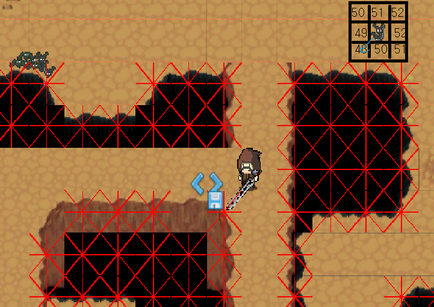
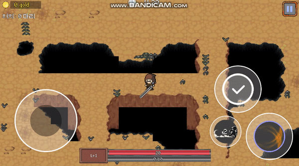
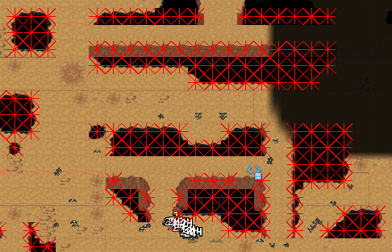

# 몬스터 길찾기 AI 알고리즘

## 알고리즘
### 구상 & 구현방안
길찾기 알고리즘에는 게임알고리즘에 가장 많이 쓰이는 A* 부터 Floyd-Warshall, 다익스트라, BFS,DFS등 다양한 알고리즘이 존재합니다
허나 상기 알고리즘들을 몬스터가 엄청 많은 AgentCute에 그냥 적용한다면 O(N(몬스터의수) * M(길찾기 알고리즘의 시간))으로 엄청 많은 시간이 소요될것으로 예상됩니다
어차피 플레이어에게만 각 몬스터가 다가오면 되기때문에 반대로 생각하여 플레이어에서 몬스터에 대해 길찾기 알고리즘을 사용하고
만들어진 DP table을 이용하여 몬스터입장에서 DP table을 참고하여 몬스터 입장 DP테이블에서 8방향중 
가장 작은 값을 찾아 오게하면 Player에게 길찾기 알고리즘 1회로 쫓아 오게 할수 있습니다

update마다 약 70by 70의 길찾기 알고리즘의 테이블을 구하는것은 전체 게임의 부하가 생길만큼 느린 작업이 아니기에 AgentCute에 적용하기 적절합니다
AgentCute에서는 길에대한 가중치가 모두 같기때문에 BFS를 사용하여 DP테이블을 만들어 몬스터 AI길찾기를 구현하였습니다.

### AI 미적용

### AI 적용

## 전처리작업
1. 1tile 기준 다일의 중앙에서 8방향으로 raycast를 발사하여 지나갈수 있는 tile인지 아닌지를 판단합니다
2. player 기준으로 플레이어의 N*N에 대해 update시마다 지나갈수 없는 곳은 1, 지나갈수있는 곳은 0으로하여 Map을 구함합니다
3. 구한 Map은 Dictionary형태로 key는 x,y value는 지나갈수있는 여부, BFS의 Distance를 저장할수 있는 Node로 설정합니다

## 적용
* AgentCute에서는 게임의 난이도를 위하여 2wave이상일 경우, 보스몹에 한하여 AI알고리즘을 적용되었습니다

## 참고소스
* [playerMove.cs](../Assets/Scripts/Unit/Player/PlayerMove.cs)
BFS생성
* [MonsterMove.cs](../Assets/Scripts/Unit/Monster/MonsterMove/MonsterMove.cs)
BFS를 참고하여 이동
* [CustomRayCastManager.cs](../Assets/Scripts/RayCastManager/CustomRayCastManager.cs)
custom raycast util

## 추가 개선방안 
* 문제 
현 게임에는 몬스터의 장애물을 못지나가는 collider에 대해 수치상 명확한 spec이 정해지지 않은 상태입니다
그래서 1tile기준으로 길찾기가 짜인 상태라 1tile내에 장애물이 있다면 원래 지나갈 수 있더라도 타일을 지나가지 못하는 문제가 발생될 수 있고
이동 관련 collider가 설정된 tile보다 크다면 이동이 제대로 안될 수도 있습니다(인 게임 이동관련 collider는 1tile이하)
* 개선 방법
전처리한 tile의 크기를 쪼개거나 늘려 동일 길찾기 알고리즘을 적용하고 이동 collider의 크기에 따라 적용한 Dicitonary를 통해 이동한다면 문제점 개선가능해집니다. 
몬스터의 collider spec이 명확해진다면 collider spec에 따라 user와 가까워진경우 1tile보다 더 쪼개진 Dictionary를 통해 접근하면 더 디테일한 길찾기도 가능해집니다
